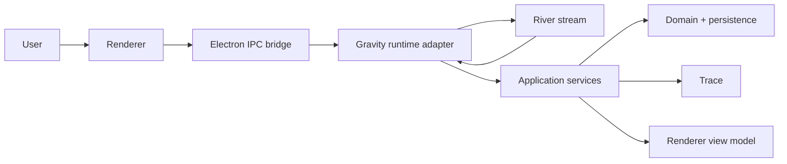

# River Integration Sketch

This note turns the River discussion into a concrete Gravity implementation shape.

The goal is not to replace Gravity's `Run`, `Thread`, `Trace`, or `Agent Activity Stream` semantics. The goal is to give Gravity a clean, resumable stream transport for agent activity and response delivery.

## Recommendation

Use River as the stream transport layer, but keep Gravity-owned meaning in Gravity.

The practical shape is:

- `PiRuntimeAdapter` produces the runtime events and stream chunks.
- `RunService` and `ThreadPanelService` stay responsible for Gravity state transitions.
- A custom Electron IPC bridge mimics River's client/server contract inside the desktop app.
- River's durable/resumable stream machinery is optional and only used where resume is actually needed.

For Gravity, the best fit is not a web-framework adapter. It is a custom Electron integration.

## Why This Fits Gravity

Gravity already has the right boundaries:

- Electron main owns privileged runtime and persistence concerns.
- The application layer owns product workflows.
- The renderer consumes view models and issues user intent.
- `Run` is Gravity's unit of execution.
- `Trace` is Gravity's retrospective record.

River should sit between the runtime boundary and the UI transport boundary, not inside the domain model.

## Concrete Mapping

| River concept    | Gravity concept                                                         |
| ---------------- | ----------------------------------------------------------------------- |
| stream router    | a Gravity stream route for a specific run or message flow               |
| stream input     | prompt, thread id, run id, project id, or similar Gravity request shape |
| stream chunk     | `Agent Activity Item`, message delta, tool event, status update         |
| stream start     | Gravity runtime session started                                         |
| stream end       | Gravity run completed and result finalized                              |
| stream error     | recoverable runtime or transport error                                  |
| fatal error      | run failure that should finalize the run as failed                      |
| resume token     | opaque handle for resuming a specific Gravity stream                    |
| durable provider | persistence backing for interrupted stream recovery                     |

## Custom Electron IPC Adapter That Mimics River

This is the option I would actually recommend for Gravity.

### Why

Gravity is already an Electron app. Introducing an HTTP framework adapter just to get River's shape would add an unnecessary server layer.

A custom IPC bridge gives you the same division of responsibility:

- main process exposes a stream endpoint
- renderer creates a typed client
- events flow as chunks
- resumption can be handled explicitly

### Shape

Main process:

- registers a `river` IPC channel
- starts a stream by creating a runtime session
- resumes a stream from a stored token or run id
- forwards chunks back to the renderer

Renderer:

- creates a typed client
- subscribes to `start` or `resume`
- consumes chunks and updates UI state

Preload:

- exposes only the narrow bridge API
- keeps renderer access safe and intentional

### Suggested module split

- `apps/desktop/src/main/runtime/river-runtime-controller.ts`
- `apps/desktop/src/main/ipc/register-river-ipc.ts`
- `apps/desktop/src/preload/index.cts`
- `apps/desktop/src/renderer/composition/use-river-stream.ts`
- `packages/adapters/src/river/river-ipc-types.ts`

## What Needs To Be Built Around River

River does not replace Gravity's product model. You still need:

- a stable mapping from stream chunks to `Agent Activity Item`
- a persistence key for resumable stream state
- a policy for when a stream becomes a `Run`
- a policy for when a stream is only discussion and not execution
- finalization rules for `RunResult` and `Trace`
- UI state shaping for live thread and run updates

## Suggested Data Flow

## Pushback On The Wrong Framing

River is not a replacement for:

- `RunService`
- `ThreadPanelService`
- `TraceService`
- `PiRuntimeAdapter`
- Gravity's persistence layer

It is a transport and resume layer. If the implementation starts moving Gravity's domain meaning into River, the integration has gone too far.
